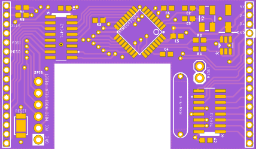
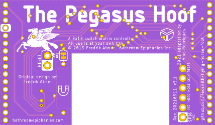

# The Flying Horse Foot

This body of work is my attempt to build a clone of "The Pegasus Hoof" keyboard controller.

This came about because some time ago I'd bought a Filco MJ2 TLK mechanical keyboard with the intent to use it as a basis of a custom build Mechanical Board ... alas, other things had priority and 7 years later I found that I could no longer buy the hacker controller - "The Pegasus Hoof" - by Fredrik Atmer of ["Bathroom Epiphanies Inc."](http://bathroomepiphanies.com/controllers/)

### Why?

I use Mac ... the Filco Majestouch 2 Tenkeyless *(also Filco Majestouch 87/88 and Filco Zero)* has Windows key-mapping (i.e., `Ctrl`, `Win`, `Alt`), and I want MacOS key-mapping (i.e., `Ctrl`, `Option` *(Alt)*, `Command`).

## Copyright

The original "The Pegasus Hoof" was a keyboard controller developed by Fredrik Atmer of ["Bathroom Epiphanies Inc."](http://bathroomepiphanies.com/controllers/)

* Rev. 20131001, *a.k.a. V1*, (c) 2013 Fredrik Atmer
* Rev. 20150108, *a.k.a. V2*, (c) 2015 Fredrik Atmer

This work is:

* Rev. 20210911, *a.k.a. V3.1*, by Vino Rodrigues, no copyright claimed
*  Attribution remains (c) 2015 Fredrik Atmer

See: [LICENSE.md](LICENSE.md)

## This Revision *(v3.1)*

This revision is schematically equivalent to (v2) **Rev. 20150108**, with a few additional features:

1. An ISP6 AVR programming header is added for easier flashing - do not populate these pins on a deployed keyboard.
   * These are not in the standard 2x3 SPI header, but rather a 1x6 inline header so that one can use them as pogo-holes.
   * Follow the instructions at the [QMK - ISP Flashing Guide](https://beta.docs.qmk.fm/using-qmk/guides/keyboard-building/isp_flashing_guide) docs page.
2. There are 3 hardware reset options:
   * The original magnetic reed-switch option is available, can be disabled to prevent unintended resets once the keyboard is deployed - scratch off the trace between JP1 to disconnect the reed switch from the circuit.
   * A reset 0.1-inch 2-pin set is provided for easy resets during programming - short the pins with a tweezer or similar.
   * An optional physical switch can be added to the board for press-button resetting.
3. Added an optional ESD protection circuit ensuring the inbound USB line cannot damage the board.

  &nbsp; 

## Firmware

### Adaptation

The [Firmware/](Firmware) folder has an adaptation that will work with QMK compiling to a VIA binary.  This can then used with VIA and a side-load JSON file, also provided.

The included source is confirmed to be working - but only supports the ANSI layout, and mapped to MacOS keyboard (WIN + ALT keys are swapped to OPT + COM).

### Originals

There are a few choices:

* Fredrik's **epiphanies_qmk_keyboard** - https://github.com/BathroomEpiphanies/epiphanies_qmk_keyboard *(requires QMK)*
  * **QMK** - https://github.com/qmk/qmk_firmware
  * See also: https://github.com/qmk/qmk_firmware/tree/master/keyboards/bpiphany/pegasushoof/ *(Use the 2015 variant)*
  * Also try the online configurator - https://config.qmk.fm/#/bpiphany/pegasushoof/2015/LAYOUT 
* Fredrik's **epiphanies_tmk_keyboard** - https://github.com/BathroomEpiphanies/epiphanies_tmk_keyboard *(requires TMK)*
  * Hasu's **TMK** - https://github.com/tmk/tmk_keyboard
* David Howland's *(a.k.a. "metalliqaz")* **EasyAVR** - https://github.com/dhowland/EasyAVR
* Fredrik's **costar_keyboard** - https://github.com/BathroomEpiphanies/costar_keyboard *(original, older)*

*(For all above use the 2015 / v2 variant of The Pegasus Hoof)*

### Flashing

The default boot loader does not support flashing from USB *(or if it does I can't find a how to)*.  As such one will need to use the supplied ISP pins and flash the board with an ISP programer like the [USBasp](https://www.fischl.de/usbasp/).

----------

## Build your own

### PCB

Using the included [Gerber](Gerber/) files, you can have this board made for you from a prototype manufacturer.

I have used the following with great success:

* [JLCPCB](https://jlcpcb.com/) *(V3.1 was made by JLCPCB on purple FR4 - love the look, and PCB is impeccable.)*
* [Smart-Prototyping](https://www.smart-prototyping.com/)  *(V3.0 board was flawlessly manufactured, albeit with a trace error that I'd overlooked the design.  I'd used black PCB and it remains my preferred colour.)*
* but there are others, like:  PCBWay, OSHPark, Seeedstudio

### Hardware / Part List

| Qty | Description                 | Size      | Mnf. Part No.         | Mouser PN            | Element14 PN | Spec. |
|-----|-----------------------------|-----------|-----------------------|----------------------|--------------|-------|
|  1  | ATmega32u2 micro controller | TQFP32    | ATMEGA32U2-AU         | 556-ATMEGA32U2-AU    | 1748524      | [&#128196;](DataSheets/01__ATmega32u2.pdf) |
|  2  | 4-10 Decoder Logic IC       | SOIC      | SN74HC42DR            | 595-SN74HC42DR       | 3119918      | [&#128196;](DataSheets/02__74HC42.pdf) |
|  1  | 16MHz crystal oscillator    | 3.2x2.5mm | CX3225SB16000E0EGFCC  | 581-CX3225SB16000EGF | *-- n/a --*  | [&#128196;](DataSheets/03a_SB16000E0.pdf) |
|     |   " *(alt)*                 |           | ABM8G-16.000MHZ-4Y-T3 | *-- n/a --*          | 2467842      | [&#128196;](DataSheets/03b_ABM8G_16MHZ.pdf) |
|  1  | 10µF electrolytic capacitor | 4.3x5.5mm | EEE-1CA100SR          | 667-EEE-1CA100SR     | 9696920      | [&#128196;](DataSheets/04__1CA100SR.pdf) |
|  2  | 18pF ceramic capacitors     | 0603      | C1608C0G1H180J080AA   | 810-C1608C0G1H180J   | 1907287      |       |
|  3  | 100nF ceramic capacitors    | 0603      | C1608X7R1E104K080AA   | 810-C1608X7R1E104K   | 2332586      |       |
|  2  | 1µF ceramic capacitors      | 0603      | C1608X7R1C105K080AC   | 810-C1608X7R1C105K   | 1907343      |       |
|  2  | 22Ω resistors               | 0603      | ERJ-3GEYJ220V         | 667-ERJ-3GEYJ220V    | 2059557      |       |
|  4  | 10kΩ resistors              | 0603      | ERJ-3GEYJ103V         | 667-ERJ-3GEYJ103V    | 2059627      |       |
|  2  | 18-pin headers, 2mm pitch   | 2mm pitch | M22-2011205           | 855-M22-2011805      | 3395122      | [Better Option](https://www.adafruit.com/product/2671) |
| ~1~ | Magnetic Reed Switch        | 15mm      | MK06-5-B              | 876-MK6-5-B          | 1079479      | [&#128196;](DataSheets/05__MK06_V02.pdf) |
| ~1~ | ESD Protection Device       | SOT-23    | TPD4S009DBVR          | 595-TPD4S009DBVR     | 3116519      | [&#128196;](DataSheets/06__tpd4s009.pdf) |
| ~1~ | Compact Tactile Switche     | 3.9x2.9mm | SKRKAEE020            | 688-SKRKAEE020       | *-- n/a --*  | [&#128196;](DataSheets/07__SKRK-1370789.pdf) |

<small>~*~ = items marked with tilde are optional.</small>
