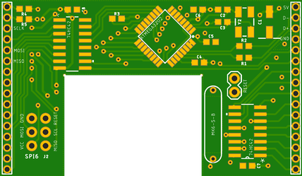
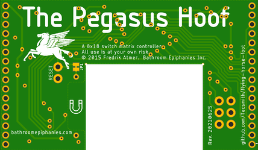

# The Flying Horse Foot

This body of work is my attempt to build a clone of "The Pegasus Hoof" keyboard controller.

This came about because some time ago I'd bought a Filco MJ2 TLK mechanical keyboard with the intent to use it as a basis of a custom build Mechanical Board ... alas, other things had priority and 7 years later I found that I could no longer buy the hacker controller - "The Pegasus Hoof" - by Fredrik Atmer of ["Bathroom Epiphanies Inc."](http://bathroomepiphanies.com/controllers/)

### Why?

I use Mac ... the Filco Majestouch 2 Tenkeyless *(also Filco Majestouch 87/88 and Filco Zero)* has Windows key-mapping (i.e., `Ctrl`, `Win`, `Alt`), and I want MacOS key-mapping (i.e., `Ctrl`, `Option` *(Alt)*, `Command`).  Also want the `Menu` key to be the `Fn` key.

## Copyright

The original "The Pegasus Hoof" was a keyboard controller developed by Fredrik Atmer of ["Bathroom Epiphanies Inc."](http://bathroomepiphanies.com/controllers/)

* Rev. 20131001, *a.k.a. V1*, (c) 2013 Fredrik Atmer
* Rev. 20150108, *a.k.a. V2*, (c) 2015 Fredrik Atmer

This work is:

* Rev. 20210625, *a.k.a. V2b*, by Vino Rodrigues, no copyright claimed
  * ***NB:*** Attribution remains (c) 2015 Fredrik Atmer

See: [LICENSE.md](LICENSE.md)

## This revision

This revision is schematically equivalent to **Rev. 20150108**, with a few additional features:

1. An ISP6 AVR programming header is added for easier flashing - do not populate these pins on a deployed keyboard.
2. A reset pin set is provided for easy resets during programming - short the pins with a tweezer or similar.
3. The magnetic reed switch can be disabled to prevent unintended resets once the keyboard is deployed - scratch off the trace between JP1 to disconnect the reed switch from the circuit.

## Firmware

Initially I'm going to try to use existing firmware - I'm not looking to reinvent the wheel *(alas, did just that for these Gerber files)*.

There are a few choices:

* Fredrik's **epiphanies_qmk_keyboard** - https://github.com/BathroomEpiphanies/epiphanies_qmk_keyboard *(requires QMK)*
  * **QMK** - https://github.com/qmk/qmk_firmware
  * See also: https://github.com/qmk/qmk_firmware/tree/master/keyboards/bpiphany/pegasushoof
  * Also try the online configurator - https://config.qmk.fm/#/bpiphany/pegasushoof/2015/LAYOUT
* Fredrik's **epiphanies_tmk_keyboard** - https://github.com/BathroomEpiphanies/epiphanies_tmk_keyboard *(requires TMK)*
  * Hasu's **TMK** - https://github.com/tmk/tmk_keyboard
* David Howland's *(a.k.a. "metalliqaz")* **EasyAVR** - https://github.com/dhowland/EasyAVR
* Fredrik's **costar_keyboard** - https://github.com/BathroomEpiphanies/costar_keyboard *(original, older)*

*(For all above use the 2015 / v2 variant of The Pegasus Hoof)*

## Hardware / Part List

| Qty | Description                 | Size      | Mnf. Part No.         | Mouser PN            | Element14 PN | Spec. |
|-----|-----------------------------|-----------|-----------------------|----------------------|--------------|-------|
|  1  | ATmega32u2 micro controller | TQFP32    | ATMEGA32U2-AU         | 556-ATMEGA32U2-AU    | 1748524      | [🗏](DataSheets/01__ATmega32u2.pdf) |
|  2  | 4-10 Decoder Logic IC       | SOIC      | SN74HC42DR            | 595-SN74HC42DR       | 3119918      | [🗏](DataSheets/02__74HC42.pdf) |
|  1  | 16MHz crystal oscillator    | 3.2x2.5mm | CX3225SB16000E0EGFCC  | 581-CX3225SB16000EGF | *-- na --*   | [🗏](DataSheets/03a_SB16000E0.pdf) |
|     |   " *(alt)*                 |           | ABM8G-16.000MHZ-4Y-T3 | *-- na --*           | 2467842      | [🗏](DataSheets/03b_ABM8G_16MHZ.pdf) |
|  1  | 10µF electrolytic capacitor | 4.3x5.5mm | EEE-1CA100SR          | 667-EEE-1CA100SR     | 9696920      | [🗏](DataSheets/04__1CA100SR.pdf) |
|  1  | Magnetic "Reed" switch      |           | MK06-5-B              | 876-MK6-5-B          | 1079479      | [🗏](DataSheets/05__MK06_V02.pdf) |
|  2  | 18pF ceramic capacitors     | 0603      | C1608C0G1H180J080AA   | 810-C1608C0G1H180J   | 1907287      | |
|  3  | 100nF ceramic capacitors    | 0603      | C1608X7R1E104K080AA   | 810-C1608X7R1E104K   | 2332586      | |
|  2  | 1µF ceramic capacitors      | 0603      | C1608X7R1C105K080AC   | 810-C1608X7R1C105K   | 1907343      | |
|  2  | 22Ω resistors               | 0603      | ERJ-3GEYJ220V         | 667-ERJ-3GEYJ220V    | 2059557      | |
|  4  | 10kΩ resistors              | 0603      | ERJ-3GEYJ103V         | 667-ERJ-3GEYJ103V    | 2059627      | |
|  3  | 510Ω resistors              | 0603      | ERJ-3GEYJ511V         | 667-ERJ-3GEYJ511V    | 2059593      | |
|  2  | 18-pin headers, 2mm pitch   | 2mm pitch | M22-2011205           | 855-M22-2011805      | 3395122      | |
